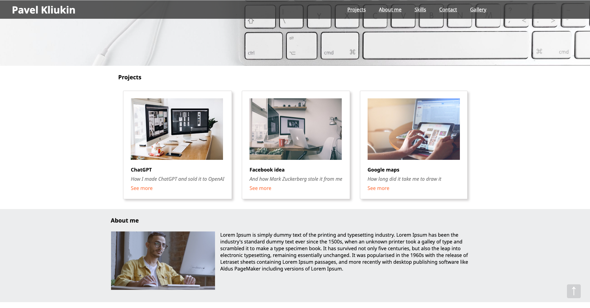

# Portfolio project

This is my training project that simulates a portfolio site.

## Features of the site:

- Header sticked to the top of the screen and has opacity change on scroll.
- Hero banner with animation.
- Inserted into the site videos in "about me" and "skills" sections.
- Back to top button.
- Animation in "skills" boxes that starts when user scrolls to the "skills" section.
- Navigation links that scrolls user to it's sections.
- Animated background on Gallery page.
- Adaptation of site for mobile devices.

### **Check it by yourself:**

https://public.bc.fi/s2300102/MyPortfolio/index.html
